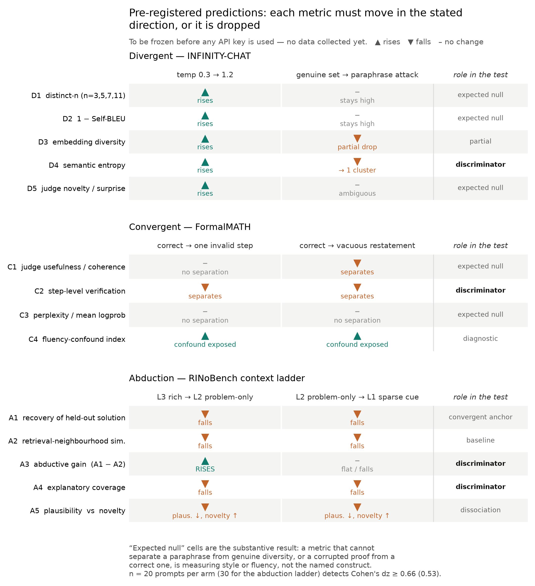

# Minimal Experiment: Metric Validation Across Divergent, Convergent, and Abductive Creativity

**Repo:** `CreativeGainBench` · **Design status:** pre-registration draft, no inference run yet
**Grounding:** repo state at `eff4193`; the two attached analyses (*Strategic Analysis: Addressing the
Structural Blind Spots in AI Creativity Benchmarking*; *Based on the combination of the three sources*)

---

## 0. What this experiment is, and what it is not

The attached analyses make an empirical claim, not a philosophical one: **current creativity metrics do
not measure the construct they name.** Creativity Index measures lexical rarity; perplexity measures
fluency; LLM-as-judge measures textual familiarity and correlates with human experts at r ≈ 0.159–0.234.
If that is true, then a benchmark that reports those metrics produces numbers that cannot be
interpreted — and no amount of extra models or extra prompts fixes it.

So the minimal experiment is **not** "run models on three datasets and report scores." It is a
**construct-validity experiment on the metrics themselves.** Every arm applies a manipulation whose
effect on the underlying faculty is known *by construction*, and asks each candidate metric one
question: did you move in the direction you must move?

A metric that fails is not a bad number. It is a number the benchmark must stop reporting.

Three properties make this the right minimal target:

- **It is falsifiable from your own data.** Ground truth comes from constructed manipulations and from
  fields already in the datasets, not from consensus.
- **It is cheap.** ~3,100 requests, ~2.0M input / 1.0M output tokens (§6). Single-digit-to-low-double-digit
  dollars on the chosen roster.
- **It gates everything downstream.** Scaling to 300 prompts × 12 models before knowing which metrics
  are valid multiplies a measurement error by 3,600.

**Explicitly out of scope:** embodied grounding, world models, sim-to-real. The Strategic Analysis is
right that these are structural blind spots, and they are *not* addressable with text-completion APIs.
One clearly-labelled text proxy is included (§4.3, G3) and must not be reported as embodiment.

---

## 1. What the repo already gives you, and three defects to fix first

| Asset | State | Use in this experiment |
|---|---|---|
| `data/subset/infinity_chat_subset.jsonl` | 300 open creative prompts, median ~28 tok | **Divergent** arm |
| `data/subset/formalmath_subset.jsonl` | 300 Algebra/Number-Theory statements | **Convergent** arm |
| `data/subset/rinobench_subset.jsonl` | 299 research ideas | **Abduction** arm |
| `data/formalmath.jsonl` | 5,560 rows; **5,555 carry a human `solution`**; `compiler_feedback_bool` True for all; `autoformalization` Lean 4 | Ground-truth proofs → error injection; optional Lean gate |
| `data/rinobench_low_novelty.jsonl` | 299 rows; **mean 23.9 `related_works` abstracts each** (min 5) | Retrieval baseline for abductive gain |
| `eval/llm_as_judge.py` | 3 judges × 4 criteria, temp 0 | One metric family among ~13; needs the fixes below |
| `cost/` | live OpenRouter pricing, Ollama Cloud tags | Re-run `estimate-cost` with the real config for the authoritative budget |

### Defect 1 — the abduction arm is currently a paraphrase task (blocking)

`prompts.py::prompt_from_rinobench` composes the prompt from `objective` **+ `problem_statement` +
`solution_approach`**. The solution is *in the prompt*. Whatever the model returns, it is restating a
given answer. This is precisely the "rich-context" failure the Strategic Analysis names — evaluation
"testing the synthesis of existing knowledge rather than the generation of truly novel ideas from
sparse cues." **No abduction metric can be validated until `solution_approach` is held out.** Fixed by
the context ladder in §4.1.

### Defect 2 — the pipeline does not connect end-to-end

`model.py` writes to `data/results/<model>/<timestamp>/<stem>.jsonl`. `llm_as_judge.py` hardcodes
`INPUT_PATH = data/results/infinity_chat_results.jsonl`, a path nothing produces. The judge also has no
CLI, so domain/model/condition cannot be varied. Needs argparse and a stable record contract before any
multi-condition run.

### Defect 3 — the judge aggregation destroys the distinction under test

`llm_as_judge.py` averages novelty, surprise, usefulness, coherence into `overall`, then averages
across judges. Novelty and coherence are the two axes the analyses say must be *dissociated*
(unorthodox-but-viable ideas get penalised on plausibility). Collapsing them into one scalar makes the
central hypothesis unmeasurable. Keep all criteria separate through to analysis; report `overall` never.
Also: with `temperature=0` and one call per judge, the "40% inconsistency" claim cannot be tested at
all — test-retest needs repeated sampling (§5).

Secondary: README says FormalMATH filter is "None (full dataset)"; `create_subset.py` filters to
Algebra ∪ Number Theory. Doc drift, worth one line.

---

## 2. Design logic: manipulation → predicted direction

Each arm pairs a **manipulation with known ground truth** against a **panel of metrics spanning the
cheap-lexical to expensive-semantic range**, so metrics can be compared against each other on identical
outputs. Two contrasts carry most of the inferential weight:

- **Divergent — the paraphrase attack.** Generate *k* genuinely different responses vs. *k* surface
  paraphrases of a single response. Both sets have high lexical diversity; only one has conceptual
  diversity. Any metric that cannot separate them is measuring style, not content. This operationalises
  the analyses' core "stylistic vs. conceptual novelty" complaint as a pass/fail test.
- **Convergent — the corruption ladder.** Human proof, verbatim → one invalid step injected → fluent but
  vacuous restatement. Validity ordering is known by construction. Any metric that scores the corrupted
  proof ≈ the correct one is measuring fluency, not validity.

*Every metric x contrast cell carries a direction fixed in advance. The "expected null" cells are
the substantive predictions: they mark where a widely-reported metric should fail to detect a
manipulation that changed the construct by construction.*

Design is **paired within prompt** throughout (same prompt across conditions), which is what makes n=20
viable.

---

## 3. Scale, and an honest power statement

**N = 20 prompts per arm, k = 5 completions per prompt, 2 generators** (one frontier + one small).

Paired t-test, α = 0.05 two-sided, 80% power:

| n (paired prompts) | 10 | 15 | **20** | 30 | 40 |
|---|---|---|---|---|---|
| min detectable Cohen's *dz* | 1.00 | 0.78 | **0.66** | 0.53 | 0.45 |

n=20 detects *dz* ≥ 0.66 — adequate for the large constructed manipulations (paraphrase attack,
corruption, full context ablation), and **underpowered for subtle effects**. Do not read a null at n=20
as "no effect"; read it as "not a large effect." Two consequences:

- Report effect sizes with bootstrap CIs, never bare p-values.
- **Recommend n=30 for the abduction ladder** (*dz* 0.53), where the L2→L1 step is expected to be the
  subtlest contrast in the design. The marginal cost is ~$1.

---

## 4. The three arms

### 4.1 Abduction — context ablation ladder (the arm that does not exist yet)

**Data:** RINoBench. The row structure is unusually well-suited: `research_idea.{objective,
problem_statement, solution_approach}` gives a held-out target, and ~24 `related_works` abstracts per
row give a *retrieval baseline* — what the idea's literature neighbourhood already contains.

**Conditions** (one prompt, three context levels):

| Level | Model is given | Asked to produce | Role |
|---|---|---|---|
| **L3 rich** | objective + problem + solution_approach | restate/extend | Ceiling / paraphrase control (= today's prompt) |
| **L2 problem** | objective + problem_statement | the solution approach | The actual abduction task |
| **L1 sparse** | 1–2 sentence surprising-observation cue distilled from objective | a hypothesis | LiveIdeaBench-style minimal context |

The L1 cue is generated once by a strong model from `objective` alone, then **frozen to a versioned
file and reviewed by hand** — it must not leak solution vocabulary, or the ladder collapses. This is the
one place in the design where a generation step can silently invalidate the arm.

**Metrics (A1–A5):**

- **A1 Hypothesis recovery** — embedding similarity of generated approach to the held-out real
  `solution_approach`. A convergent anchor for abduction: did the model rediscover the actual idea?
- **A2 Retrieval-neighbourhood similarity** — max similarity to the row's `related_works` abstracts.
  High = recombining what is already adjacent in the literature.
- **A3 Abductive gain = A1 − A2.** *Proposed metric.* Recovering the held-out idea while remaining
  distant from its literature neighbourhood is the signature of a leap rather than a retrieval. Cheap,
  needs no judge, and directly targets "synthesis of existing knowledge vs. generation from sparse
  cues." The Strategic Analysis notes the critique paper "does not propose a new metric" — A3 is a
  concrete, falsifiable one.
- **A4 Explanatory coverage** — structured judge rubric: does the hypothesis explain the stated problem
  (full / partial / no), with the explanandum quoted back. Scored separately from novelty.
- **A5 Plausibility × novelty, kept two-dimensional.** Never collapsed.

**Predictions.** A1 falls monotonically L3 → L2 → L1. A3 *rises* from L3 to L2 (L3 cannot show gain —
the answer was supplied). Any metric flat across the ladder is measuring fluency and is disqualified.

**Headline analysis — measuring the penalisation bias.** Plot judge plausibility (A5) against abductive
gain (A3) across all L1/L2 outputs. The analyses *assert* that unorthodox-but-viable ideas are penalised
as infeasible. A significantly negative slope would be the first direct measurement of that bias on your
own stack — and it is nearly free, being a re-analysis of data the arm already produces.

**Expert-label anchor — requires a data fix.** RINoBench ships a human `novelty_score` + `novelty_reasoning`,
but `download_dataset.py` filters to `novelty_score <= 2`, leaving **60 ones and 239 twos**: almost no
variance, unusable as an anchor. Re-download the unfiltered split and draw a variance-stratified n=20
for this correlation only.

### 4.2 Convergent — corruption ladder against ground-truth proofs

**Data:** FormalMATH, using the `solution` field (5,555 human proofs) as ground truth rather than as a
prompt.

**Conditions** per item — three proof variants with a known validity ordering **a > b > c**:

- **a** verbatim human proof
- **b** one invalid step injected (quantifier flip, invalid algebraic step, unjustified case) by a strong
  model under explicit instruction, **with the diff recorded** so the injected flaw is auditable
- **c** fluent, confident restatement of the claim that proves nothing

Plus model-generated proof attempts for the same statements, to place live outputs on the ladder.

**Metrics (C1–C5):**

- **C1 Judge usefulness / coherence** — must order a > b > c.
- **C2 Step-level verification** — decompose into steps, verify each independently, aggregate by
  minimum (a proof is as valid as its weakest step). *Proposed metric.*
- **C3 Fluency proxy (perplexity / mean logprob)** — predicted **flat** across a, b, c. That flatness is
  the result: it reproduces "score distributions for creative and uncreative texts overlap
  significantly" on your own data. (Dependency: a roster model that returns logprobs.)
- **C4 Fluency-confound index** — partial correlation of each validity metric with length and fluency,
  controlling for true validity.
- **C5 Lean gate (stretch, optional).** All 5,560 rows have compiling `autoformalization`, so a genuine
  non-LLM verifier is reachable — but Mathlib is a multi-GB, multi-hour toolchain build. Descope from
  the minimal run; keep as the follow-up that converts C1/C2 from "agrees with construction" to
  "agrees with a compiler."

**Predictions.** C1 separates c from {a,b} but **fails to separate a from b** — the fluency confound.
C2 separates a from b. If C2 succeeds where C1 fails, that is a concrete, publishable metric contribution.

### 4.3 Divergent — paraphrase attack and temperature contrast

**Data:** INFINITY-CHAT creative prompts.

**Conditions:** (i) temperature 0.3, (ii) temperature 1.2, (iii) **paraphrase attack** — one response,
then *k*−1 instructed surface paraphrases (same content, different wording).

**Metrics (D1–D5):**

- **D1 Distinct-n / n-gram uniqueness, computed at n = 3, 5, 7, 11.** The Creativity Index family. The
  multiple n is deliberate: the Strategic Analysis states CI "can vary by a factor of two" between
  ranges 5–7 and 5–11. This is a **free reproduction of a cited fragility claim** on your own outputs —
  no extra API calls, since it is post-hoc on text you already have. Report the spread as a stability
  statistic, not a single CI number.
- **D2 Self-BLEU** — legacy lexical baseline.
- **D3 Semantic diversity** — 1 − mean pairwise cosine over sentence embeddings.
- **D4 Semantic entropy** — bidirectional-entailment clustering of the *k* completions; report cluster
  count and entropy over cluster sizes. The concept-level metric the analyses point toward.
- **D5 Judge novelty + surprise**, reported separately.

Plus **G3 (grounding smoke test, clearly labelled a text proxy):** on physically-flavoured outputs, a
dimensional-consistency and conservation-law check. This is *not* embodiment and must be reported as a
lower bound on physical-compliance screening.

**Predictions.** Temperature 0.3 → 1.2 raises D1–D3. The paraphrase attack is the discriminator: D1/D2
stay **high** (wording genuinely varies) while D4 collapses toward **one cluster**. Metrics that rank
the paraphrase set as diverse as the genuine set are measuring style and are disqualified for divergent
scoring.

---

## 5. Cross-cutting reliability layer (cheap, and it tests a headline claim)

Re-run the judge panel **3× at temperature 0 and 3× at temperature 1** on a 25% subsample, and swap A/B
order in every pairwise comparison. Yields:

- **Test-retest ICC** and score-flip rate per criterion → does the "40% inconsistency" figure hold on
  your stack?
- **Position-bias magnitude** → the "one-sided prediction bias."
- **Inter-judge agreement** across the three panel models.

This is ~700 extra requests and converts a cited number into a measured one. It also sets the noise
floor: no metric can be credited with resolving an effect smaller than its own test-retest error.

## 5b. Human anchor (n = 40) — criterion validity

Synthetic controls establish *discriminant* validity (does the metric respond to the construct?). Only
human labels establish *criterion* validity (does it agree with expert judgment?) — and the r = 0.159 /
0.234 figures are criterion-validity claims. Per your choice:

- **40 forced-choice pairs**, blind to condition: 20 abduction (L2/L1 hypotheses, sampled to span the
  A3 range) + 20 proof variants (mixed a/b/c). Pairwise rather than Likert — better reliability at small
  n, and no scale-anchoring drift.
- Delivered as a self-contained HTML/CSV labelling sheet; ~60–90 min of work.
- Analysis: Kendall τ / Spearman ρ of each metric against human preference, with bootstrap CIs, plotted
  against the 0.159 and 0.234 reference lines.
- **Honest caveat, stated in the paper:** n=40 gives roughly ±0.3 on ρ. This tells you whether a metric
  is in the "barely correlated" regime or the "usefully correlated" regime. It does not rank two metrics
  that land 0.1 apart.

---

## 6. Budget

Computed from the actual design (N=20, k=5, 2 generators, 3 judges, reliability + anchor layers):

| Arm | Conditions | Gen calls | Completions | Input tok | Output tok |
|---|---:|---:|---:|---:|---:|
| Divergent (infinity_chat) | 3 | 80 | 400 | 11,840 | 280,000 |
| Convergent (formalmath) | 3 variants | 40 | 200 | 6,920 | 180,000 |
| Abduction (rinobench) | 3 levels | 120 | 600 | 46,320 | 300,000 |
| **Generation total** | | **240** | **1,200** | **65,080** | **760,000** |

Judging: 720 judged completions × 3 judges = 2,160, plus 540 reliability re-runs and 120 anchor
comparisons → **2,820 judge calls** (~1.97M in / 254k out). Embeddings: ~1,320 texts, batched.

**Total ≈ 3,100 requests; ~2.0M input / ~1.0M output tokens.**

Uniform-price envelopes (sanity bounds, not the plan):

| If *all* traffic ran at | Cost |
|---|---|
| 4o-mini class | ~$0.91 |
| Sonnet class | ~$21 |
| Opus class | ~$107 |

The chosen split — generation on one frontier + one small model, judging on the cheap/free panel already
in `llm_as_judge.py` — lands in the **low single-digit to ~$15** range. Judge traffic dominates
(2,820 of 3,100 requests), so *judge* model choice is the cost lever, not generator choice. Run
`estimate-cost` with the final config for the authoritative figure; the token heuristic there is
`len/4`, not a native tokenizer.

**Rate limits are the real risk, not dollars.** The current judge panel is `:free` OpenRouter tiers with
429-retry already in place. 2,820 judge calls against free tiers will throttle; budget wall-clock in
hours, or move the judge panel to paid slugs (still ~$2–5 at this volume).

---

## 7. Pre-registration discipline

Before any key is used, freeze a `PREREGISTRATION.md` containing: the predicted direction for every
metric × condition cell (§8 figure), the disqualification rule (**a metric that fails its predicted
direction is dropped from benchmark reporting, not re-tuned until it passes**), the primary vs.
exploratory split, and multiple-comparison handling across the ~13 metrics (Benjamini–Hochberg within
arm).

Without this, a 13-metric × 9-condition grid will produce significant-looking cells by chance, and the
experiment becomes the thing the analyses criticise: a dashboard that cannot be wrong.

---

## 8. Deliverables and branch plan

Four stacked PRs. **Three are reviewable and mergeable before any API access** — only PR4 spends tokens.

| PR | Branch | Contents | Needs keys? |
|---|---|---|---|
| 1 | `fix/pipeline-plumbing` | judge CLI + argparse; stable result-record contract; per-criterion scores (drop `overall`); path fix; README drift | No |
| 2 | `feat/ablation-prompts` | RINoBench context ladder L1/L2/L3 (**fixes the solution leak**); frozen + hand-reviewed L1 cue file; corruption & paraphrase condition builders with recorded diffs; unfiltered-novelty subset | No |
| 3 | `feat/metrics-suite` | `metrics/{divergent,convergent,abduction,reliability}.py`; A1–A5, C1–C4, D1–D5; unit tests on fixtures with known answers | No |
| 4 | `feat/minimal-experiment` | `PREREGISTRATION.md`, run config, runner, `analyze.py`, figures, human-anchor labelling sheet | **Yes** |

Final artifacts: per-metric validity table (passed / failed / underpowered), the
plausibility-vs-abductive-gain figure, the CI n-range stability figure, judge reliability figures, and a
one-page recommendation on which metrics `CreativeGainBench` should report.
